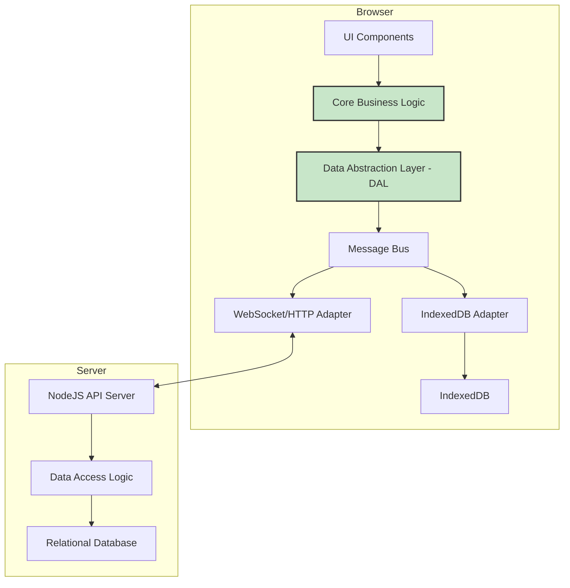
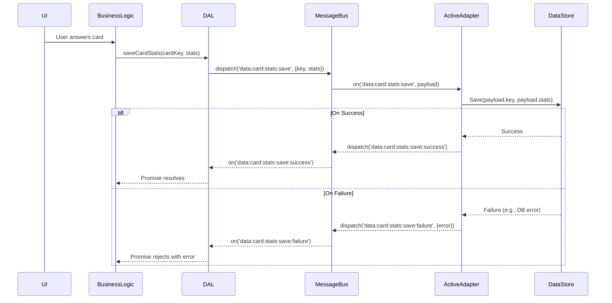

# Isomorphic Client/Server Architecture Design

This document outlines a proposed architecture to refactor the application into an isomorphic structure. The goal is to enable the same business logic to run seamlessly in two different environments:

1.  **Client-Only (Offline-First):** The application runs entirely in the browser, using IndexedDB as its data store. This provides a robust offline experience.
2.  **Client-Server (Connected):** The application runs in the browser and communicates with a NodeJS backend, which in turn manages a relational database (SQLite/Postgres).

The core of this proposal is the introduction of a **Data Abstraction Layer (DAL)** and a **Message Bus**, which will decouple the application's business logic from the underlying data storage and communication mechanisms.

## 1. High-Level Architecture

The new architecture will be composed of three main parts:

*   **Core Business Logic:** This contains the application's rules, data processing, and state management. It is environment-agnostic.
*   **Data Abstraction Layer (DAL):** A unified interface for all data operations (CRUD). It acts as a "switch" that directs requests to the appropriate data source based on the current mode (online/offline).
*   **Data Stores:** These are the actual storage mechanisms. Initially, this will be IndexedDB for the client and the existing SQLite database on the server.

### Component Diagram

This diagram illustrates the major components and their relationships.



**Components:**

*   **UI Components:** The user interface of the application.
*   **Core Business Logic:** The "brains" of the application, responsible for managing application state and logic (e.g., card logic, skill management).
*   **Data Abstraction Layer (DAL):** Provides a simple, consistent API (e.g., `getData()`, `saveData()`) for the business logic to interact with.
*   **Message Bus:** An internal event bus on the client. The DAL dispatches events to this bus.
*   **Adapters (IndexedDB, WebSocket/HTTP):** These adapters listen to the message bus and handle the actual data storage/retrieval. Only the active adapter will process the request.
*   **IndexedDB:** The in-browser, key-value database for offline storage.
*   **NodeJS API Server:** The existing backend server.
*   **Data Access Logic:** Server-side logic to interact with the database.
*   **Relational Database:** The server's database (e.g., SQLite).

## 2. Data Flow and Messages

The data flow will change depending on whether the application is in "offline" or "online" mode. Communication between the DAL and the adapters is handled via namespaced messages on the Message Bus.

### Message Definitions
To ensure clarity and prevent event collisions, messages will be namespaced. The main unit of interaction is the flashcard, identified by the target language text.

*   `data:card:next`: Request to retrieve the next card to be reviewed.
*   `data:card:stats:save`: Save the interaction results for a specific card.
*   `data:config:save`: Save a configuration object.
*   `data:config:load`: Load a configuration object.

Each action will have corresponding `success` and `failure` messages, e.g., `data:config:save:success` and `data:config:save:failure`.

### Sequence Diagram: Saving Card Statistics

This diagram shows the sequence of events when the application saves card interaction statistics.



## 3. Error Handling
A robust error handling strategy is crucial. Errors can occur at multiple points (network, database, validation). The general principle is that the DAL returns a Promise that will be rejected upon failure, allowing the business logic and UI to respond appropriately.

When an adapter encounters an error (e.g., a network request fails or an IndexedDB write operation throws an exception), it will:
1.  Catch the error.
2.  Dispatch a corresponding `failure` event on the message bus (e.g., `data:config:save:failure`).
3.  Include the error object in the event payload.

The DAL, upon receiving the failure event, will reject the promise it returned to the business logic, which can then update the UI to inform the user (e.g., "Failed to save. Please try again.").

## 4. Online/Offline Mode Switching

The application must be able to seamlessly switch between online and offline modes.

*   **Status Detection:** The application will use the standard `navigator.onLine` browser API to detect the initial online/offline status. It will also listen for the `online` and `offline` window events to handle changes in connectivity.
*   **State Management:** The current mode (e.g., `'online'` or `'offline'`) will be managed as part of the global application state.
*   **Adapter Activation:** The DAL will be responsible for directing messages to the correct adapter. It will check the current application mode before dispatching an event. For example:
    ```javascript
    // Inside the DAL
    saveData(key, data) {
        const eventName = 'data:config:save';
        if (getState().mode === 'online') {
            this.messageBus.dispatch(eventName, { target: 'api', payload: { key, data } });
        } else {
            this.messageBus.dispatch(eventName, { target: 'indexeddb', payload: { key, data } });
        }
        // ... return a promise that resolves/rejects based on success/failure events
    }
    ```
    Adapters will listen for messages and inspect the `target` property to determine if they should act on the message.

## 5. Synchronization Strategy

A simple "last-write-wins" strategy is risky and can lead to data loss. A more sophisticated approach is required for the long term.

### Initial Strategy (MVP)
For the initial implementation, we will use a "last-write-wins" approach but with clear user notification. When the application comes online, it will check if there is local data that needs to be synced. The user will be prompted to either push their local changes to the server (overwriting server data) or discard their local changes.

### Long-Term Strategy
A more robust solution will involve the following:
1.  **Conflict Detection:** Use version vectors (or at a minimum, `updated_at` timestamps) for each piece of data. When syncing, the client and server can compare versions to detect conflicts.
2.  **Data Merging:** For non-conflicting changes (e.g., the user updated one card offline and a different card on another device), the changes can be automatically merged.
3.  **User-driven Resolution:** When a direct conflict is detected (e.g., the same card was modified both locally and on the server), the UI must prompt the user to resolve the conflict by choosing which version to keep.

## 6. Implementation Plan

The implementation will be broken down into the following steps:

1.  **Create the Data Abstraction Layer (DAL):**
    *   Create a new module, `lib/core/data-abstraction-layer.js`.
    *   This module will expose a simple API for data operations (e.g., `get`, `set`, `delete`).
    *   It will internally manage the "mode" (online/offline) and delegate calls to the appropriate adapter via the message bus.

2.  **Implement the Message Bus:**
    *   A simple, in-memory event emitter can be created or a small library can be used. This will live in a new `lib/core/message-bus.js` file.

3.  **Create Data Store Adapters:**
    *   **IndexedDB Adapter (`lib/dal/indexeddb-adapter.js`):** This will contain the logic to interact with the browser's IndexedDB. It will wrap IndexedDB operations in Promises.
    *   **API Adapter (`lib/dal/api-adapter.js`):** This will handle communication with the backend server. Initially, it can use the existing `fetch`-based API calls. It can be upgraded to use WebSockets later for real-time communication.

4.  **Refactor Business Logic:**
    *   Modify the existing modules (`config-manager.js`, `skill-manager.js`, `card-logic.js`) to use the new DAL instead of directly calling `fetch` or accessing local storage.
    *   For example, instead of `syncToServer()`, a call like `DAL.set('configs', allConfigs)` would be used.

By following this design, we can achieve a highly flexible and maintainable architecture that supports both online and offline use cases while maximizing code reuse.