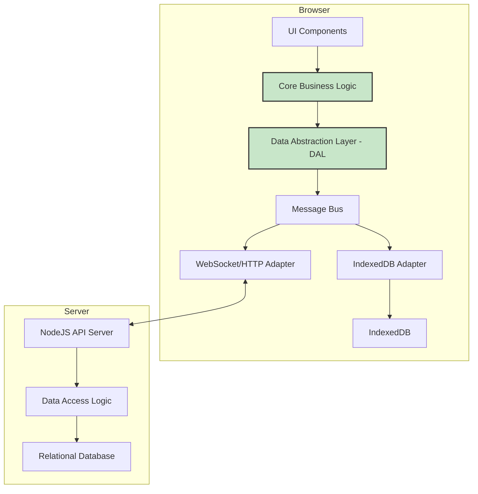
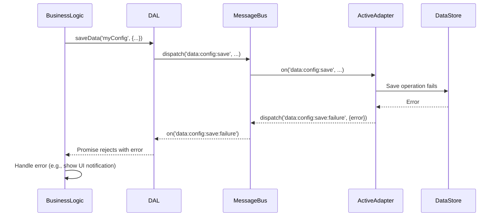

# Isomorphic Client/Server Architecture Design

This document outlines a proposed architecture to refactor the application into an isomorphic structure. The goal is to enable the same business logic to run seamlessly in two different environments:

1.  **Client-Only (Offline-First):** The application runs entirely in the browser, using IndexedDB as its data store. This provides a robust offline experience.
2.  **Client-Server (Connected):** The application runs in the browser and communicates with a NodeJS backend, which in turn manages a relational database (SQLite/Postgres).

The core of this proposal is the introduction of a **Data Abstraction Layer (DAL)** and a **Message Bus**, which will decouple the application's business logic from the underlying data storage and communication mechanisms.

## 1. High-Level Architecture

### Component Diagram

This diagram illustrates the major components and their relationships.

## 2. Message Bus and Definitions

Communication between the DAL and the data adapters is handled via a namespaced message bus. This ensures clarity and prevents event collisions.

| Message Name                 | Direction      | Payload                                     | Description                                                                    |
| ---------------------------- | -------------- | ------------------------------------------- | ------------------------------------------------------------------------------ |
| `data:config:load`           | DAL -> Adapter | `{ key: string }`                           | Request to load a specific configuration object.                               |
| `data:config:load:success`   | Adapter -> DAL | `{ key: string, value: object }`            | Response when a configuration is loaded successfully.                          |
| `data:config:save`           | DAL -> Adapter | `{ key: string, value: object }`            | Request to save a specific configuration object.                               |
| `data:config:save:success`   | Adapter -> DAL | `{ key: string, value: object }`            | Response when a configuration is saved successfully.                           |
| `data:card:stats:load`       | DAL -> Adapter | `{ key: string }`                           | Request to load the statistics for a specific card.                            |
| `data:card:stats:load:success`| Adapter -> DAL | `{ key: string, value: object }`            | Response when card stats are loaded successfully.                            |
| `data:card:stats:save`       | DAL -> Adapter | `{ key: string, value: object }`            | Request to save the statistics for a specific card.                            |
| `data:card:stats:save:success`| Adapter -> DAL | `{ key:string, value: object }`             | Response when card stats are saved successfully.                             |
| `data:sync:all:load`         | DAL -> Adapter | `null`                                      | Request to load all user data (configs and stats) for initial sync.            |
| `data:sync:all:load:success` | Adapter -> DAL | `{ configs: object, cardStats: object }`    | Response with all user data.                                                 |
| `data:sync:all:save`         | DAL -> Adapter | `{ configs: object, cardStats: object }`    | Request to save all user data in a bulk operation.                           |
| `data:sync:all:save:success` | Adapter -> DAL | `null`                                      | Response when all data has been saved successfully.                          |
| `*:failure`                  | Adapter -> DAL | `{ error: Error }`                          | Generic failure message. The `*` is a wildcard for any request message name. |

## 3. Data Store Mapping

This section details how the data payloads from the message bus map onto the underlying storage mechanisms.

### IndexedDB Mapping
The IndexedDB database will be simple, containing two main object stores to mirror the data types managed by the application:
*   `configs`: Stores user configuration objects.
*   `cardStats`: Stores learning statistics for each card.

For a message like `data:config:save` with a payload of `{ key: 'my-deck-config', value: { ... } }`, the IndexedDB adapter will perform the following operation:
*   **Database:** `flashcardsDB`
*   **Object Store:** `configs`
*   **Action:** `put()`
*   **Key:** `'my-deck-config'`
*   **Value:** `{ "value": { ... }, "_version": 1 }`

The `_version` field is added to the stored object to support the synchronization strategy.

### Relational Database (Server-side) Mapping
The existing `user_data` table in the SQLite database is well-suited for this model. The API Adapter will translate messages into `POST /api/sync` requests. The backend will then map the data to the `user_data` table as follows:

| Message Data    | `user_data` Table Column | Value                                                              |
| --------------- | ------------------------ | ------------------------------------------------------------------ |
| Data Type       | `type`                   | `'configs'` or `'cardStat'`                                        |
| `key`           | `key`                    | The `key` from the message payload (e.g., `'my-deck-config'`).     |
| `value`         | `value`                  | A JSON string of the object `{ "value": { ... }, "_version": 1 }`. |
| User            | `user_id`                | The ID of the authenticated user.                                  |

The `value` column, which currently stores the configuration or stat object directly, will now store a new object that wraps the original `value` and includes the `_version` metadata. This change is necessary to support the conflict resolution mechanism. The server-side logic will need to be updated to handle this new structure.

## 4. Error Handling

A robust error handling strategy is crucial. The DAL returns a Promise for every request, which will be rejected upon failure, allowing the business logic and UI to respond appropriately. When an adapter encounters an error, it will dispatch a namespaced `failure` event (e.g., `data:config:save:failure`) on the message bus.

### Sequence Diagram: Error Handling Example

## 5. Online/Offline Mode Switching

The application will use the standard `navigator.onLine` browser API and `online`/`offline` window events to detect connectivity changes. This status will be stored in the global application state. The DAL inspects this state to determine which adapter (API or IndexedDB) should handle a given request.

## 6. Conflict Resolution and Synchronization

To prevent data loss, a robust synchronization strategy is required. This strategy relies on versioning each piece of data.

### Data Versioning
Each record stored (both in IndexedDB and on the server) will include a version counter (`_version`). This is a simple integer that is incremented with every modification.

### Synchronization Flow
Synchronization is triggered when the application comes online after a period of being offline.

1.  **Client Initiates Sync:** The client sends the server a list of all locally modified records along with their version numbers.
2.  **Server Compares Versions:** The server iterates through the client's records and compares them with its own versions.
3.  **Conflict Resolution Logic:**
    *   **No Conflict (Client Ahead):** If the client's `_version` is greater than the server's, the server's record is outdated. The server updates its record with the client's data and new version number.
    *   **No Conflict (Server Ahead):** If the server's `_version` is greater, the client's record is outdated. The server sends its version to the client, which updates its local record.
    *   **No Conflict (New Data):** If the client has a record that the server doesn't (or vice versa), the record is simply copied to the other party.
    *   **Conflict Detected:** If the server has also modified a record that the client modified offline, a conflict exists.

### User-Driven Conflict Resolution
When a conflict is detected, the application must not automatically overwrite data.

1.  **Flag Conflicting Items:** The server returns a list of conflicting items to the client.
2.  **Present to User:** The UI will display a modal showing the conflicts. For each conflict, the user will see their local version and the server's version side-by-side.
3.  **User Resolves:** The user must choose which version to keep.
4.  **Finalize Resolution:** Once the user makes a choice, the resolved version is saved with an incremented `_version` to both the client and the server, ensuring they are back in sync.

## 7. Implementation Plan

The implementation will be broken down into the following steps:

1.  **Create the Data Abstraction Layer (DAL).**
2.  **Implement the Message Bus.**
3.  **Create Data Store Adapters (IndexedDB and API).**
4.  **Refactor Business Logic to use the DAL.**
5.  **Update Server-side Logic to handle data versioning.**