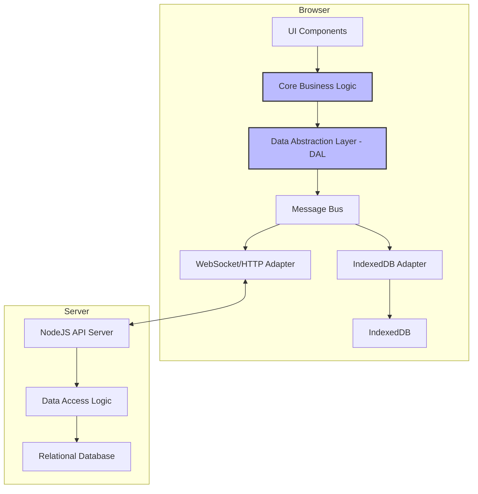
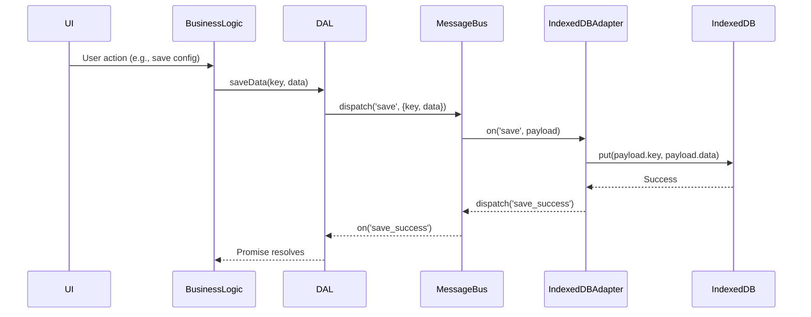
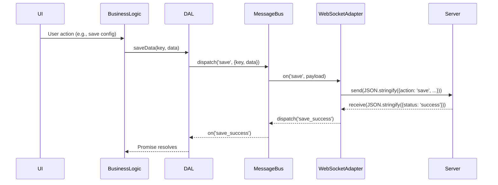

# Isomorphic Client/Server Architecture Design

This document outlines a proposed architecture to refactor the application into an isomorphic structure. The goal is to enable the same business logic to run seamlessly in two different environments:

1.  **Client-Only (Offline-First):** The application runs entirely in the browser, using IndexedDB as its data store. This provides a robust offline experience.
2.  **Client-Server (Connected):** The application runs in the browser and communicates with a NodeJS backend, which in turn manages a relational database (SQLite/Postgres).

The core of this proposal is the introduction of a **Data Abstraction Layer (DAL)** and a **Message Bus**, which will decouple the application's business logic from the underlying data storage and communication mechanisms.

## 1. High-Level Architecture

The new architecture will be composed of three main parts:

*   **Core Business Logic:** This contains the application's rules, data processing, and state management. It is environment-agnostic.
*   **Data Abstraction Layer (DAL):** A unified interface for all data operations (CRUD). It acts as a "switch" that directs requests to the appropriate data source based on the current mode (online/offline).
*   **Data Stores:** These are the actual storage mechanisms. Initially, this will be IndexedDB for the client and the existing SQLite database on the server.

### Component Diagram

This diagram illustrates the major components and their relationships.

**Components:**

*   **UI Components:** The user interface of the application.
*   **Core Business Logic:** The "brains" of the application, responsible for managing application state and logic (e.g., card logic, skill management).
*   **Data Abstraction Layer (DAL):** Provides a simple, consistent API (e.g., `getData()`, `saveData()`) for the business logic to interact with.
*   **Message Bus:** An internal event bus on the client. The DAL dispatches events to this bus.
*   **Adapters (IndexedDB, WebSocket/HTTP):** These adapters listen to the message bus and handle the actual data storage/retrieval. Only the active adapter will process the request.
*   **IndexedDB:** The in-browser, key-value database for offline storage.
*   **NodeJS API Server:** The existing backend server.
*   **Data Access Logic:** Server-side logic to interact with the database.
*   **Relational Database:** The server's database (e.g., SQLite).

## 2. Data Flow

The data flow will change depending on whether the application is in "offline" or "online" mode.

### Sequence Diagram: Saving Data

This diagram shows the sequence of events when the application saves data.

#### Client-Only (Offline) Mode

#### Client-Server (Online) Mode

## 3. Implementation Plan

The implementation will be broken down into the following steps:

1.  **Create the Data Abstraction Layer (DAL):**
    *   Create a new module, `lib/core/data-abstraction-layer.js`.
    *   This module will expose a simple API for data operations (e.g., `get`, `set`, `delete`).
    *   It will internally manage the "mode" (online/offline) and delegate calls to the appropriate adapter via the message bus.

2.  **Implement the Message Bus:**
    *   A simple, in-memory event emitter can be created or a small library can be used. This will live in a new `lib/core/message-bus.js` file.

3.  **Create Data Store Adapters:**
    *   **IndexedDB Adapter (`lib/dal/indexeddb-adapter.js`):** This will contain the logic to interact with the browser's IndexedDB. It will wrap IndexedDB operations in Promises.
    *   **API Adapter (`lib/dal/api-adapter.js`):** This will handle communication with the backend server. Initially, it can use the existing `fetch`-based API calls. It can be upgraded to use WebSockets later for real-time communication.

4.  **Refactor Business Logic:**
    *   Modify the existing modules (`config-manager.js`, `skill-manager.js`, `card-logic.js`) to use the new DAL instead of directly calling `fetch` or accessing local storage.
    *   For example, instead of `syncToServer()`, a call like `DAL.set('configs', allConfigs)` would be used.

5.  **Develop a Synchronization Strategy:**
    *   When switching from offline to online, a synchronization process will be needed to resolve any conflicts between the local (IndexedDB) and remote (server) data.
    *   A simple "last-write-wins" strategy can be implemented initially, where the client's data is pushed to the server upon connection. The `updated_at` timestamp in the `user_data` table will be crucial here.

By following this design, we can achieve a highly flexible and maintainable architecture that supports both online and offline use cases while maximizing code reuse.