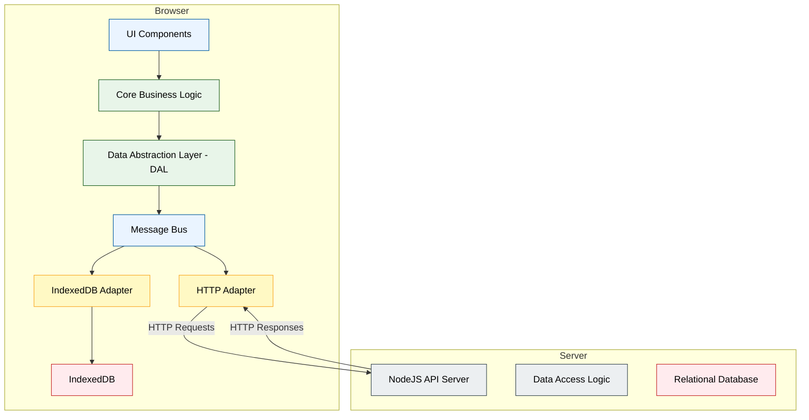
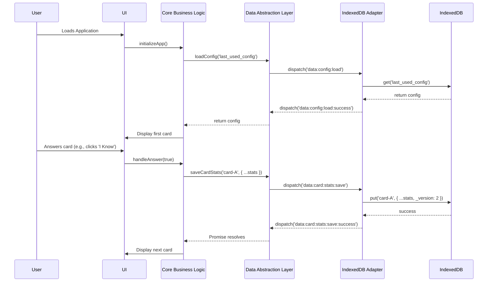
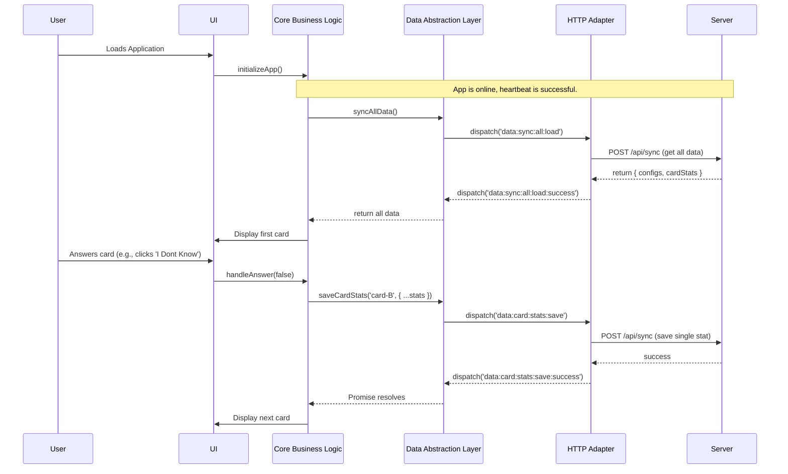

# Isomorphic Client/Server Architecture Design

This document outlines a proposed architecture to refactor the application into an isomorphic structure. The goal is to enable the same business logic to run seamlessly in two different environments:

1. **Client-Only (Offline-First):** The application runs entirely in the browser, using IndexedDB as its data store. This provides a robust offline experience.
2. **Client-Server (Connected):** The application runs in the browser and communicates with a NodeJS backend, which in turn manages a relational database (SQLite/Postgres).

The core of this proposal is the introduction of a **Data Abstraction Layer (DAL)** and a **Message Bus**, which will decouple the application's business logic from the underlying data storage and communication mechanisms.

## 1. High-Level Architecture

### Component Diagram

This diagram illustrates the major components and their relationships. The communication between the `HTTP Adapter` and the `NodeJS API Server` will be implemented using HTTP requests (`POST /api/sync`) initially. The architecture is designed to accommodate WebSockets for real-time communication in the future if needed.



## 2. Message Bus and Definitions

Communication between the DAL and the data adapters is handled via a namespaced message bus. This ensures clarity and prevents event collisions.

| Message Name                   | Direction      | Payload                                  | Description                                                                  |
| ------------------------------ | -------------- | ---------------------------------------- | ---------------------------------------------------------------------------- |
| `data:config:load`             | DAL -> Adapter | `{ key: string }`                        | Request to load a specific configuration object.                             |
| `data:config:load:success`     | Adapter -> DAL | `{ key: string, value: object }`         | Response when a configuration is loaded successfully.                        |
| `data:config:save`             | DAL -> Adapter | `{ key: string, value: object }`         | Request to save a specific configuration object.                             |
| `data:config:save:success`     | Adapter -> DAL | `{ key: string, value: object }`         | Response when a configuration is saved successfully.                         |
| `data:card:stats:load`         | DAL -> Adapter | `{ key: string }`                        | Request to load the statistics for a specific card.                          |
| `data:card:stats:load:success` | Adapter -> DAL | `{ key: string, value: object }`         | Response when card stats are loaded successfully.                            |
| `data:card:stats:save`         | DAL -> Adapter | `{ key: string, value: object }`         | Request to save the statistics for a specific card.                          |
| `data:card:stats:save:success` | Adapter -> DAL | `{ key: string, value: object }`         | Response when card stats are saved successfully.                             |
| `data:sync:all:load`           | DAL -> Adapter | `null`                                   | Request to load all user data (configs and stats) for initial sync.          |
| `data:sync:all:load:success`   | Adapter -> DAL | `{ configs: object, cardStats: object }` | Response with all user data.                                                 |
| `data:sync:all:save`           | DAL -> Adapter | `{ configs: object, cardStats: object }` | Request to save all user data in a bulk operation.                           |
| `data:sync:all:save:success`   | Adapter -> DAL | `null`                                   | Response when all data has been saved successfully.                          |
| `*:failure`                    | Adapter -> DAL | `{ error: Error }`                       | Generic failure message. The `*` is a wildcard for any request message name. |

## 3. Data Store Mapping

### IndexedDB Mapping

The IndexedDB database will be simple, containing two main object stores:

- `configs`: Stores user configuration objects.
- `cardStats`: Stores learning statistics for each card.

For a message like `data:config:save`, the adapter will store an object that includes both the data and versioning metadata.

### Relational Database (Server-side) Mapping

The existing `user_data` table in the SQLite database is well-suited for this model. The API Adapter will translate messages into `POST /api/sync` requests.

| Message Data | `user_data` Table Column | Value                                                           |
| ------------ | ------------------------ | --------------------------------------------------------------- |
| Data Type    | `type`                   | `'configs'` or `'cardStats'`                                    |
| `key`        | `key`                    | The `key` from the message payload (e.g., `'my-deck-config'`).  |
| `value`      | `value`                  | A JSON string of the object containing the data and versioning. |
| User         | `user_id`                | The ID of the authenticated user.                               |

## 4. Error Handling

The DAL returns a Promise for every request, which will be rejected upon failure. When an adapter encounters an error, it will dispatch a namespaced `failure` event (e.g., `data:config:save:failure`) on the message bus, allowing the business logic to handle it.

## 5. Online/Offline Mode Switching

To provide a reliable user experience, connectivity is determined by a **heartbeat mechanism** rather than the unreliable `navigator.onLine` API.

- **Heartbeat:** The application will periodically send a lightweight request to a dedicated server endpoint (e.g., `GET /api/health`).
- **Status Management:** If the heartbeat request succeeds, the application's state is set to `online`. If it fails (e.g., due to a timeout or network error), the state is set to `offline`. This state determines which data adapter (HTTP or IndexedDB) the DAL will use.

## 6. Conflict Resolution and Synchronization

To prevent data loss from simultaneous edits, the synchronization strategy must reliably detect and resolve conflicts.

### Data and Versioning Payload

Each record will include a `base_version` and a `new_version` to ensure accurate conflict detection. The `value` stored in the database will be a JSON object containing the data and versioning metadata.

```json
{
  "key": "card-A",
  "data": { "prompt": "Hello", "answer": "Hola" },
  "base_version": 4,
  "new_version": 5
}
```

### Synchronization Flow

When the application comes online, it initiates a sync process for all locally modified data.

1. **Client Sends Sync Request:** For each modified record, the client sends the `key`, `data`, `base_version` (the version it started with), and `new_version` to the server.
2. **Server Conflict Detection:** The server compares the client's `base_version` with the version currently stored in its database (`server_version`).
   - **No Conflict:** If `client.base_version == server_version`, there is no conflict. The server updates its record with the client's data and sets its version to `client.new_version`.
   - **Conflict Detected:** If `client.base_version != server_version`, another client has already updated the record. This is a conflict.

### User-Driven Conflict Resolution

When a conflict is detected, the application must not automatically overwrite data.

1. **Server Returns Conflicts:** The server rejects the sync request and returns a list of the conflicting items, including the server's current version of the data.
2. **UI Presents Conflicts:** The UI displays a modal showing the conflicts. For each item, the user sees their local version and the server's version side-by-side.
3. **User Resolves:** The user chooses which version to keep.
4. **Finalize Resolution:** Once resolved, the chosen version is sent back to the server with the correct `base_version` to finalize the update.

## 7. End-to-End User Flow Scenarios

These diagrams illustrate the complete user flow from loading the application to completing a skills exercise in both offline and online modes.

### Scenario 1: Offline Mode (In-Browser Only)

This sequence shows the application loading data from IndexedDB and saving progress locally.



### Scenario 2: Online Mode (Client-Server Communication)

This sequence shows the application syncing data with the server upon loading and saving progress back to the server.



## 8. Implementation Plan

1. **Create the Data Abstraction Layer (DAL).**
2. **Implement the Message Bus.**
3. **Create Data Store Adapters (IndexedDB and HTTP).**
4. **Refactor Business Logic to use the DAL.**
5. **Update Server-side Logic to handle the new versioning and conflict detection scheme.**
