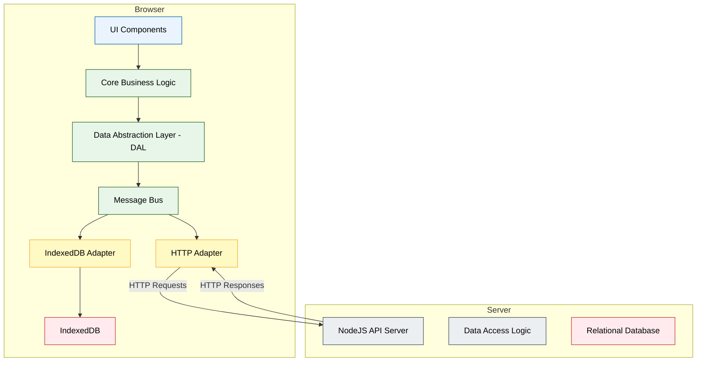
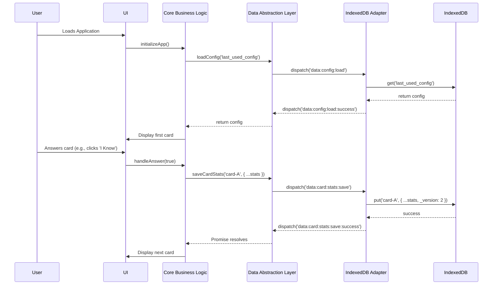
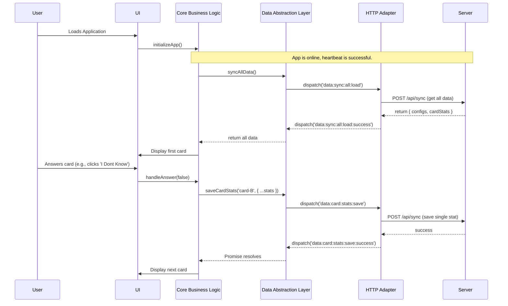

# Isomorphic Client/Server Architecture Design

This document outlines a proposed architecture to refactor the application into an isomorphic structure. The goal is to enable the same business logic to run seamlessly in two different environments:

1. **Client-Only (Offline-First):** The application runs entirely in the browser, using IndexedDB as its data store. This provides a robust offline experience.
2. **Client-Server (Connected):** The application runs in the browser and communicates with a NodeJS backend, which in turn manages a relational database (SQLite/Postgres).

The core of this proposal is the introduction of a **Data Abstraction Layer (DAL)** and a **Message Bus**, which will decouple the application's business logic from the underlying data storage and communication mechanisms.

## 1. High-Level Architecture

### Component Diagram

This diagram illustrates the major components and their relationships. The communication between the `HTTP Adapter` and the `NodeJS API Server` will be implemented using HTTP requests (`POST /api/sync`) initially. The architecture is designed to accommodate WebSockets for real-time communication in the future if needed.



## 2. Isomorphic Code and Shared Libraries

A key goal of this architecture is to maximize code reuse between the client (browser) and server (Node.js) environments. This is achieved by writing environment-agnostic business logic in shared modules. These modules will be written as standard ES Modules, which are supported in both modern browsers and Node.js. To ensure portability, these shared modules will not directly access environment-specific global APIs like the browser's `window` or `document` objects, or Node.js's `fs` module. Any necessary interaction with the environment will be handled by dedicated modules injected into the core logic.

The following table identifies the core modules that will be shared.

| Shared Module (from `lib/core/`) | Description                                                               | Key Responsibilities                                                                                          |
| -------------------------------- | ------------------------------------------------------------------------- | ------------------------------------------------------------------------------------------------------------- |
| `card-logic.js`                  | Manages the core logic of spaced repetition and card selection.           | - Calculating card retention scores. <br>- Determining the next card to review based on SRS algorithms.       |
| `skill-manager.js`               | Handles the creation, modification, and validation of skill definitions.  | - Creating new skill configurations. <br>- Validating the structure of skill objects.                         |
| `config-manager.js`              | Manages user and deck configurations.                                     | - Loading and saving configuration objects. <br>- Providing default configurations.                           |
| `validation.js` (new module)     | Contains pure functions for validating the structure of all data objects. | - Validating the shape of `cardStats` objects. <br>- Validating the shape of `configs` objects before saving. |

These shared modules will form the heart of the application's business logic, ensuring that data is processed and validated consistently, regardless of where the code is running.

## 3. Message Bus and Definitions

Communication between the DAL and the data adapters is handled via a namespaced message bus.

| Message Name                   | Direction      | Payload                                  | Description                                                                  |
| ------------------------------ | -------------- | ---------------------------------------- | ---------------------------------------------------------------------------- |
| `data:config:load`             | DAL -> Adapter | `{ key: string }`                        | Request to load a specific configuration object.                             |
| `data:config:load:success`     | Adapter -> DAL | `{ key: string, value: object }`         | Response when a configuration is loaded successfully.                        |
| `data:config:save`             | DAL -> Adapter | `{ key: string, value: object }`         | Request to save a specific configuration object.                             |
| `data:config:save:success`     | Adapter -> DAL | `{ key: string, value: object }`         | Response when a configuration is saved successfully.                         |
| `data:card:stats:load`         | DAL -> Adapter | `{ key: string }`                        | Request to load the statistics for a specific card.                          |
| `data:card:stats:load:success` | Adapter -> DAL | `{ key: string, value: object }`         | Response when card stats are loaded successfully.                            |
| `data:card:stats:save`         | DAL -> Adapter | `{ key: string, value: object }`         | Request to save the statistics for a specific card.                          |
| `data:card:stats:save:success` | Adapter -> DAL | `{ key: string, value: object }`         | Response when card stats are saved successfully.                             |
| `data:sync:all:load`           | DAL -> Adapter | `null`                                   | Request to load all user data (configs and stats) for initial sync.          |
| `data:sync:all:load:success`   | Adapter -> DAL | `{ configs: object, cardStats: object }` | Response with all user data.                                                 |
| `data:sync:all:save`           | DAL -> Adapter | `{ configs: object, cardStats: object }` | Request to save all user data in a bulk operation.                           |
| `data:sync:all:save:success`   | Adapter -> DAL | `null`                                   | Response when all data has been saved successfully.                          |
| `*:failure`                    | Adapter -> DAL | `{ error: Error }`                       | Generic failure message. The `*` is a wildcard for any request message name. |

## 4. Data Store Mapping

### IndexedDB Mapping

The IndexedDB database will be simple, containing three main object stores:

- `configs`: Stores user configuration objects.
- `cardStats`: Stores learning statistics for each card.
- `unresolved_conflicts`: Stores conflict data that the user has not yet resolved.

### Relational Database (Server-side) Mapping

The existing `user_data` table in the SQLite database is well-suited for this model.

| Message Data | `user_data` Table Column | Value                                                           |
| ------------ | ------------------------ | --------------------------------------------------------------- |
| Data Type    | `type`                   | `'configs'` or `'cardStats'`                                    |
| `key`        | `key`                    | The `key` from the message payload (e.g., `'my-deck-config'`).  |
| `value`      | `value`                  | A JSON string of the object containing the data and versioning. |
| User         | `user_id`                | The ID of the authenticated user.                               |

## 5. Error Handling

The DAL returns a Promise for every request, which will be rejected upon failure. When an adapter encounters an error, it will dispatch a namespaced `failure` event on the message bus.

## 6. Online/Offline Mode Switching

Connectivity is determined by a **heartbeat mechanism**. The application will periodically send a lightweight request to a server endpoint (e.g., `GET /api/health`). If the request succeeds, the state is `online`; otherwise, it's `offline`.

## 7. Conflict Resolution and Synchronization

To prevent data loss from simultaneous edits, a robust synchronization strategy is required. This strategy relies on versioning to reliably detect and resolve conflicts, with the user being the final arbiter in any dispute.

### Data and Versioning Payload

Each record sent to the server for synchronization will include not just the new data but also versioning information.

```json
{
  "key": "card-A",
  "data": { "prompt": "Hello", "answer": "Hola" },
  "base_version": 4,
  "new_version": 5
}
```

- **`base_version`**: The version number of the record when the client last synced it. This tells the server what state the client _thinks_ the data was in before modification.
- **`new_version`**: The new version number after the client's modifications.

### Detailed Synchronization and Conflict Resolution Flow

1.  **Client Initiates Sync:** When the application comes online, it gathers all locally modified records from IndexedDB and sends them to the server in a single batch request.

2.  **Server Conflict Detection:** For each record in the batch, the server performs the following check:
    - It retrieves its current version of the record (`server_version`).
    - It compares the `base_version` from the client with the `server_version`.
    - **No Conflict:** If `client.base_version == server_version`, the server updates its record and version, then marks the item as successfully synced.
    - **Conflict Detected:** If `client.base_version != server_version`, a conflict exists. The server **does not** modify its data for this record. It marks the item as conflicted.

3.  **Server Responds:** The server sends a response to the client detailing the outcome of the batch sync. This response includes a list of successfully synced items and a list of all conflicting items. For each conflict, the server provides the client's attempted data alongside the server's current data and version.

4.  **Client Surfaces Conflicts to User:** The client's business logic receives the conflict list.
    - It triggers a UI event to display a prominent, non-blocking notification (e.g., a toast or a banner) that says "Sync conflicts detected. Please review."
    - A persistent badge or indicator will also appear on the sync/status icon in the main UI.

5.  **Conflict Resolution UI:** When the user clicks the notification or the sync icon, a modal dialog will appear.
    - This modal will list each conflicting item (e.g., by card name or configuration name).
    - Clicking an item in the list will display a clear, side-by-side view: "Your Version (Offline)" on the left, and "Server's Version" on the right, with the differing fields highlighted.
    - Below the comparison, two buttons will be presented:
      - **"Keep My Changes"**: This option will discard the server's version and re-submit the user's local version to the server for saving.
      - **"Use Server's Changes"**: This option will discard the user's local, offline changes. The client will then fetch the server's version and update its local IndexedDB store.
    - A manual merge option is considered out of scope for the initial implementation due to its complexity.

6.  **Handling Unresolved Conflicts:** If the user goes offline or closes the modal before resolving all conflicts:
    - The list of unresolved conflicts (including the server's version of the data for each) will be stored locally in a dedicated IndexedDB object store (`unresolved_conflicts`).
    - The sync icon will remain in a "conflict" state.
    - The user will be prompted to resolve the remaining items the next time they are online and initiate a sync.

7.  **Finalizing Resolution:** Once the user makes a choice in the UI, the client takes the appropriate action.
    - If "Keep My Changes" is chosen, the client sends a new request to the server for that specific item. This time, the `base_version` will be the `server_version` that was returned in the conflict response, ensuring the update succeeds.
    - If "Use Server's Changes" is chosen, the client updates its local IndexedDB with the server's data and version.

This process ensures that no data is ever lost automatically and gives the user full control over resolving discrepancies.

## 8. End-to-End User Flow Scenarios

### Scenario 1: Offline Mode (In-Browser Only)



### Scenario 2: Online Mode (Client-Server Communication)



## 9. Testing Strategy

A multi-layered testing strategy will be crucial to ensure the reliability of this architecture. We will use the existing `mocha` and `chai` frameworks.

- **Unit Tests:**
  - The shared, isomorphic modules (`card-logic.js`, `skill-manager.js`, etc.) will be tested extensively with unit tests. Since these are designed as pure, environment-agnostic modules, they can be tested easily in a Node.js test environment without any browser-specific APIs.
  - Focus will be on testing business logic, validation rules, and data transformations.

- **Adapter Tests:**
  - Each adapter will be tested in isolation.
  - **`IndexedDBAdapter`:** We will use an in-memory mock of IndexedDB, such as `fake-indexeddb`, to test the adapter's ability to correctly perform CRUD operations without relying on a real browser environment.
  - **`HTTPAdapter`:** We will use a library like `sinon` to mock the `fetch` API. This will allow us to simulate various server responses (success, network errors, server errors, conflict responses) and verify that the adapter handles them correctly.

- **Integration Tests:**
  - These tests will verify that the DAL, Message Bus, and adapters work correctly together.
  - We will create a test environment where we can programmatically switch the application's state between `online` and `offline`.
  - Tests will assert that the DAL dispatches messages correctly and that the appropriate adapter (and only that adapter) responds to them based on the current mode.

- **End-to-End (E2E) Tests:**
  - A high-level E2E testing plan will use a browser automation framework like Playwright or Cypress.
  - These tests will simulate real user scenarios:
    1.  **Offline-first workflow:** Load the app, go offline, make changes, go back online, and verify that the data syncs correctly.
    2.  **Conflict resolution workflow:** Set up a conflict scenario on the backend, go online, and verify that the conflict resolution UI appears and functions as expected.
  - These tests will leverage the browser's built-in developer tools (via the testing framework) to simulate offline conditions.

## 10. Implementation Plan

1. **Create a `lib/shared` directory for isomorphic modules.**
2. **Refactor existing logic from `lib/core` into the new shared modules.**
3. **Write unit tests for all shared modules.**
4. **Create the Data Abstraction Layer (DAL) and Message Bus.**
5. **Create and test the Data Store Adapters (IndexedDB and HTTP).**
6. **Write integration tests for the DAL and adapters.**
7. **Refactor the UI and business logic to use the DAL.**
8. **Update Server-side Logic to handle data versioning and the new conflict response.**
9. **Implement the conflict resolution UI and client-side logic.**
10. **Develop E2E tests for offline mode and conflict resolution.**
