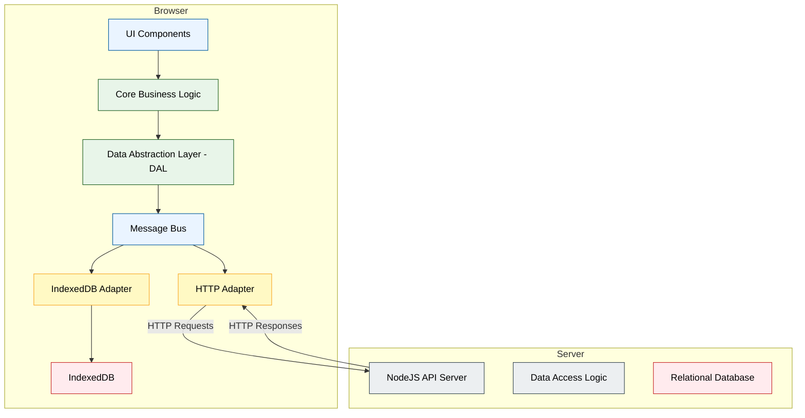
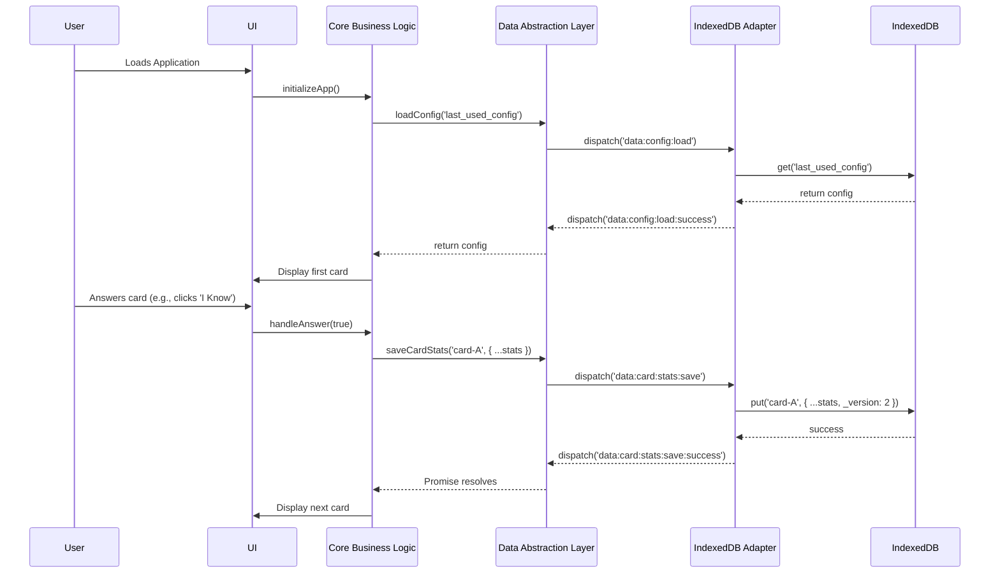
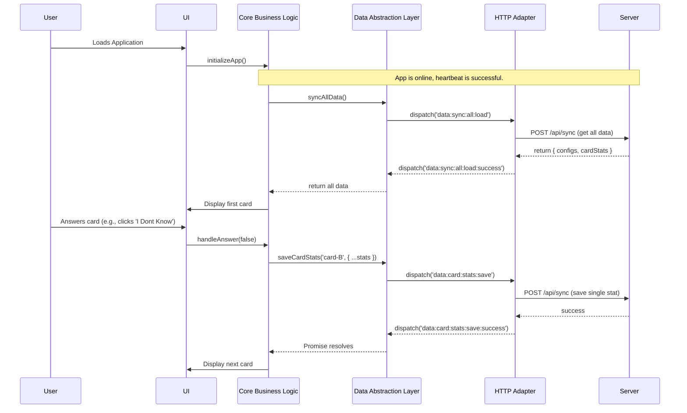

# Isomorphic Client/Server Architecture Design

This document outlines a proposed architecture to refactor the application into an isomorphic structure. The goal is to enable the same business logic to run seamlessly in two different environments:

1. **Client-Only (Offline-First):** The application runs entirely in the browser, using IndexedDB as its data store. This provides a robust offline experience.
2. **Client-Server (Connected):** The application runs in the browser and communicates with a NodeJS backend, which in turn manages a relational database (SQLite/Postgres).

The core of this proposal is the introduction of a **Data Abstraction Layer (DAL)** and a **Message Bus**, which will decouple the application's business logic from the underlying data storage and communication mechanisms.

## 1. High-Level Architecture

### Component Diagram

This diagram illustrates the major components and their relationships. The communication between the `HTTP Adapter` and the `NodeJS API Server` will be implemented using HTTP requests (`POST /api/sync`) initially. The architecture is designed to accommodate WebSockets for real-time communication in the future if needed.

## 2. Isomorphic Code and Shared Libraries

A key goal of this architecture is to maximize code reuse between the client (browser) and server (Node.js) environments. This is achieved by writing environment-agnostic business logic in shared modules. These modules will be written as standard ES Modules, which are supported in both modern browsers and Node.js.

The following table identifies the core modules that will be shared. These modules will be designed to be pure, without direct dependencies on browser-specific APIs (like the DOM) or server-specific APIs (like the file system).

| Shared Module (from `lib/core/`) | Description                                                               | Key Responsibilities                                                                                          |
| -------------------------------- | ------------------------------------------------------------------------- | ------------------------------------------------------------------------------------------------------------- |
| `card-logic.js`                  | Manages the core logic of spaced repetition and card selection.           | - Calculating card retention scores.  - Determining the next card to review based on SRS algorithms.       |
| `skill-manager.js`               | Handles the creation, modification, and validation of skill definitions.  | - Creating new skill configurations.  - Validating the structure of skill objects.                         |
| `config-manager.js`              | Manages user and deck configurations.                                     | - Loading and saving configuration objects.  - Providing default configurations.                           |
| `validation.js` (new module)     | Contains pure functions for validating the structure of all data objects. | - Validating the shape of `cardStats` objects.  - Validating the shape of `configs` objects before saving. |

These shared modules will form the heart of the application's business logic, ensuring that data is processed and validated consistently, regardless of where the code is running.

## 3. Message Bus and Definitions

Communication between the DAL and the data adapters is handled via a namespaced message bus. This ensures clarity and prevents event collisions.

| Message Name                   | Direction      | Payload                                  | Description                                                                  |
| ------------------------------ | -------------- | ---------------------------------------- | ---------------------------------------------------------------------------- |
| `data:config:load`             | DAL -> Adapter | `{ key: string }`                        | Request to load a specific configuration object.                             |
| `data:config:load:success`     | Adapter -> DAL | `{ key: string, value: object }`         | Response when a configuration is loaded successfully.                        |
| `data:config:save`             | DAL -> Adapter | `{ key: string, value: object }`         | Request to save a specific configuration object.                             |
| `data:config:save:success`     | Adapter -> DAL | `{ key: string, value: object }`         | Response when a configuration is saved successfully.                         |
| `data:card:stats:load`         | DAL -> Adapter | `{ key: string }`                        | Request to load the statistics for a specific card.                          |
| `data:card:stats:load:success` | Adapter -> DAL | `{ key: string, value: object }`         | Response when card stats are loaded successfully.                            |
| `data:card:stats:save`         | DAL -> Adapter | `{ key: string, value: object }`         | Request to save the statistics for a specific card.                          |
| `data:card:stats:save:success` | Adapter -> DAL | `{ key: string, value: object }`         | Response when card stats are saved successfully.                             |
| `data:sync:all:load`           | DAL -> Adapter | `null`                                   | Request to load all user data (configs and stats) for initial sync.          |
| `data:sync:all:load:success`   | Adapter -> DAL | `{ configs: object, cardStats: object }` | Response with all user data.                                                 |
| `data:sync:all:save`           | DAL -> Adapter | `{ configs: object, cardStats: object }` | Request to save all user data in a bulk operation.                           |
| `data:sync:all:save:success`   | Adapter -> DAL | `null`                                   | Response when all data has been saved successfully.                          |
| `*:failure`                    | Adapter -> DAL | `{ error: Error }`                       | Generic failure message. The `*` is a wildcard for any request message name. |

## 4. Data Store Mapping

### IndexedDB Mapping

The IndexedDB database will be simple, containing two main object stores:

- `configs`: Stores user configuration objects.
- `cardStats`: Stores learning statistics for each card.

### Relational Database (Server-side) Mapping

The existing `user_data` table in the SQLite database is well-suited for this model.

| Message Data | `user_data` Table Column | Value                                                           |
| ------------ | ------------------------ | --------------------------------------------------------------- |
| Data Type    | `type`                   | `'configs'` or `'cardStats'`                                    |
| `key`        | `key`                    | The `key` from the message payload (e.g., `'my-deck-config'`).  |
| `value`      | `value`                  | A JSON string of the object containing the data and versioning. |
| User         | `user_id`                | The ID of the authenticated user.                               |

## 5. Error Handling

The DAL returns a Promise for every request, which will be rejected upon failure. When an adapter encounters an error, it will dispatch a namespaced `failure` event on the message bus.

## 6. Online/Offline Mode Switching

Connectivity is determined by a **heartbeat mechanism**. The application will periodically send a lightweight request to a server endpoint (e.g., `GET /api/health`). If the request succeeds, the state is `online`; otherwise, it's `offline`.

## 7. Conflict Resolution and Synchronization

Synchronization relies on versioning to prevent data loss. Each record will have a `base_version` and a `new_version`. A conflict occurs if the server's version does not match the `base_version` sent by the client. Conflicts must be resolved by the user.

## 8. End-to-End User Flow Scenarios

### Scenario 1: Offline Mode (In-Browser Only)

### Scenario 2: Online Mode (Client-Server Communication)

## 9. Implementation Plan

1. **Create a `lib/shared` directory for isomorphic modules.**
2. **Refactor existing logic from `lib/core` into the new shared modules.**
3. **Create the Data Abstraction Layer (DAL).**
4. **Implement the Message Bus.**
5. **Create Data Store Adapters (IndexedDB and HTTP).**
6. **Refactor Business Logic to use the DAL.**
7. **Update Server-side Logic to handle data versioning.**
